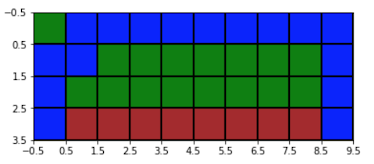
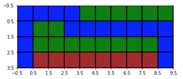
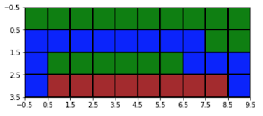
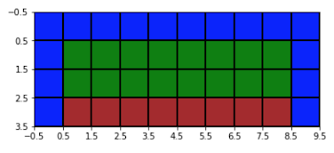
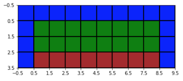
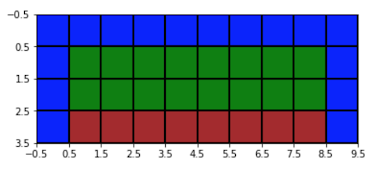
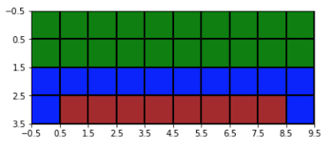
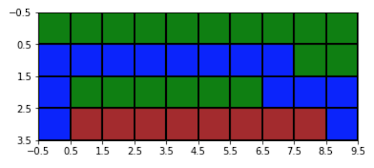

# TabulaRL
Library for implementing Tabular Reinforcement Learning Algorithms

Implementing a RL algorithm it is as simple as changing parameters of a TaskController instance

```
tc = TaskController(
        cliff_jump,  <-- The task being performed 
        learning_algorithm='FIRST_VISIT_MC', <-- QLEARNING, SARSA, EXPECTED_SARSA, EVERY_VISIT_MC, FIRST_VISIT_MC
        exploration=True, <-- Whether to explore or not
        exploration_decay='CONSTANT', <-- CONSTANT, SIMULATED_ANNEALING, LOGARITHMIC (decay of exploration rate)
        exploration_strategy='SOFT_E_GREEDY', <-- E_GREEDY, SOFT_E_GREEDY
        exploration_epsilon=0.8, <-- exploration rate
        learning_rate=0.05, <-- learning rate
        learning_rate_decay='EXPONENTIAL', <-- CONSTANT, LOGARITHMIC (decay of learning rate)
        gamma=0.9, <-- gamma to look ahead
        online_learning=False <-- Learn online or in episodes
    )
```

Some results for a toy task cliff_jump as defined in the book [Reinforcement Learning: An Introduction](http://incompleteideas.net/book/the-book-2nd.html) are displayed below. The task is defined as follows -

[alt text](images/task.png)

In above image, you start at bottom left corner and try to reach bottom right corner (goal). If you reach goal, you get 100 points, if you enter any of red cells, you get -50, and for every movement you get either 0 or -1 (if you want to reach fastest) depending on game

## GAME TYPE 1: 
The agents path is in blue and you get 0 for every move and 100 if goal reached and -50 if you enter red area. trained for 1000 episodes with various tuned parameters

### Results:

| Every Visit Monte Carlo | First Visit Monte Carlo |
:-------------------------:|:-------------------------:
  |  
| SARSA with online learning | SARSA with batch learning |
:-------------------------:|:-------------------------:
  |  
| Expected SARSA with online learning | Expected SARSA with batch learning |
:-------------------------:|:-------------------------:
  |  
| Qlearning in online learning mode | Qlearning in batch learning mode |
:-------------------------:|:-------------------------:
  |  
